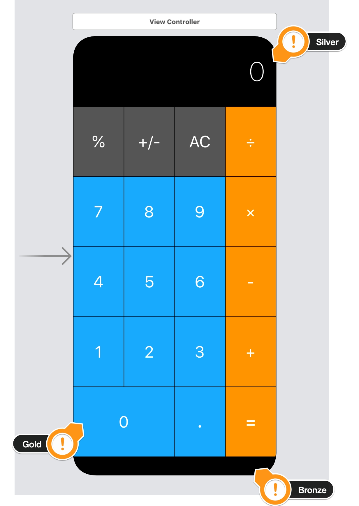
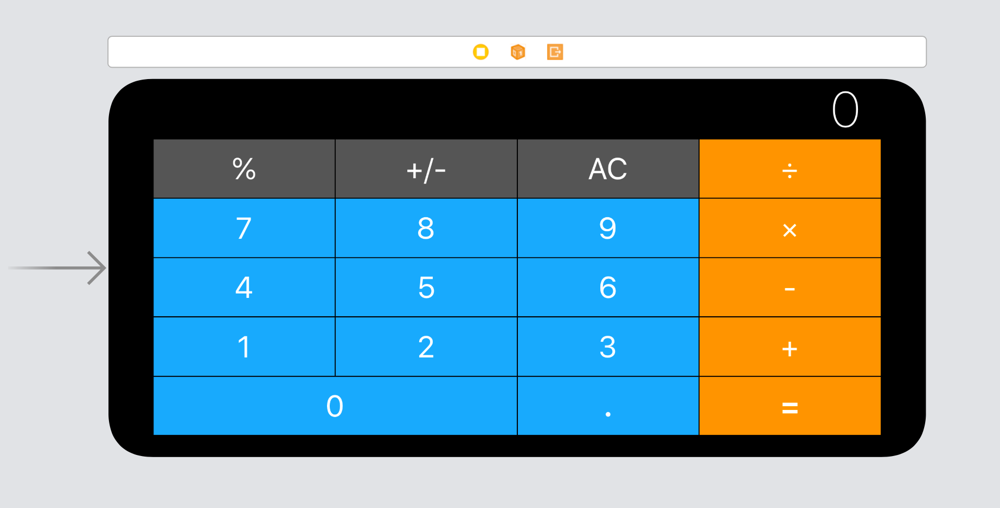

The challenge took me 3 hours. I completed the challenge and can get my gold medal :)
What Did I Learn?
* How to add constraints and understand how auto layout
works.
* How to Pin and Align UI elements.
* How to create containers to configure advanced layouts.
* How to debug auto layout errors.
* Understand the pre-requisites to automatic layout.
*  How to use stack views to easily layout your UI.

screenshots:

# Calculator Layout Boss Challenge

No knowledge is your own until you put it into practice. Using what you've learnt about auto layout, stack views and setting constraints, create the following UI. 

## Portrait

## Landscape

This is a difficult challenge. You pass the challenge if you can create the vertical and horizontal stacks required for the layout. Once you've done that, you can also get extra credit if you figure out how to layout the small details.

Bronze Medal: If you can figure out how to have the layout be constrained to the Safe Areas in Portrait and Landscape. (Notice the distance to the edges is different between landscape and portrait.

Silver Medal: If you can figure out how to indent the Label with the 0 so that there is 20px distance from the right edge of the screen.

Gold Medal: If you can figure out how to make the 0 button take up twice as much width as the "." and "=" buttons.

